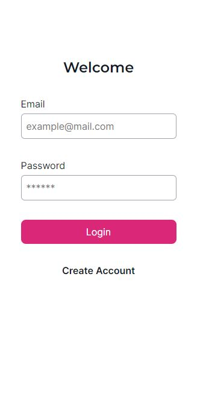

# Project: Expensable

## Objective

Build the MVP of a web-based expense management application.

## Initial Configuration 

Before starting the server, you need to run:

### `npm install`

Then, in the project directory, you can run:

### `npm start`

Runs the app in the development mode.\
Open [http://localhost:3000](http://localhost:3000) to view it in your browser.

## Details

Login Page               | Create Account          
:-------------------------:|-------------------------:
  | 

Main Page (Expense)               |  Main Page (Income)         
:-------------------------:|-------------------------:
  | 

Transactions Filters               |  New Category (Expense/Income)         
:-------------------------:|-------------------------:
  |  

## Features:

- **Users can login with their account or create a new account**
- **Users can create categories for their expenses or incomes**
- **Users can add transactions to each categories**
- **Users can filter their expenses or incomes and see their total for each day**
